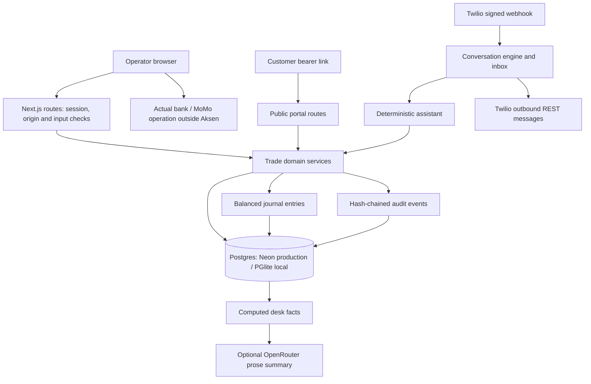

# Aksen OTC — business-flow and deployment audit

Review date: 5 October 2026. Scope: the current working tree, including the substantial pre-existing uncommitted implementation. This is a readiness review, not a production security certification. Live Neon, Twilio, Meta, bank/MoMo and OpenRouter calls were not exercised. No client money was moved or external customer messages sent.

**Decision: proceed with a synthetic demonstration; do not yet make this the sole operational system for a real-money client.** Repair the confirmed control gaps, resolve messaging-provider eligibility, and then run a supervised shadow pilot against the client's existing records. The underlying architecture is worth keeping.

## What the product actually is

A multi-tenant operating desk for a licensed business handling NGN/GHS currency trades. Its practical value is connecting quotes, customer acceptance, statement checks, payout approval, externally executed payments, evidence, and reconciliation in one record. Aksen itself does not execute the bank/MoMo transfer in the reviewed implementation.

The business hypothesis is that desks lose time and accountability when conversations, rates, receipts, approvals and balances sit in separate chats and spreadsheets. The code addresses that workflow. It does not establish a quantified loss reduction, fraud-detection accuracy, settlement speed, customer demand or regulatory eligibility. Those require client discovery and measured pilot evidence.

The current website is substantially more accurate than README.md. The README still advertises zero leakage, institutional/air-gapped operation, forensic image analysis, NIBSS verification, automatic account rotation to avoid bank flags, real-time wholesale rates, and live Meta processing. Those are not supported by the current production flow. Do not use that README as a client proposal or deployment guide.

## Architecture and responsibilities

The modular monolith is appropriate for this stage. Keep one authoritative trade engine; do not rebuild it as microservices. Money calculations use scaled BigInt rates and integer minor units. Trades use database transactions, row locks and optimistic versions. Customer links are HMAC-signed and can be reissued; sessions store hashes of random tokens, passwords use salted scrypt, and role checks run server-side. Basic tenant isolation and tamper detection are covered by tests.

Important limits: tenancy relies on application filters rather than database RLS/composite tenant foreign keys. Conversation serialization and request rate limits are per process. Audit hashes are tamper-evident, not immutable against a database owner who can rewrite both events and the stored head. Cross-trade liquidity checks read account balances without locking/reserving that account, so production Postgres concurrency needs a specific stress test. PGlite tests alone do not establish Neon concurrency behavior.

## Business claim → implemented flow

| Business need | Current implementation | Boundary / gap |
|---|---|---|
| Faster, consistent quotes | Rate board; both corridors; pay/receive amount modes; fees; expiring quotes | Rates and reference rates are entered by the operator, not fetched from a live market feed |
| Clear customer agreement | Signed customer page, beneficiary entry, acceptance, instructions and timeline | Bearer possession is the authorization; no customer OTP; link has revocation but no explicit independent expiry |
| Avoid paying from fake slips | Evidence is separate from actual funds; statement credit must be recorded; duplicate file/reference checks; warnings | No OCR/ELA/font/NIBSS validation or independent bank-credit verification |
| Controlled payouts | Admin approval; second person above configurable thresholds; recorded payout reference | Payments occur outside Aksen; no bank API or multi-signature execution; new risk after approval is not rechecked |
| Liquidity visibility | Opening balances, top-ups, withdrawals, transfers and trade journal entries | These are book balances, not live bank balances; no robust reservation across concurrent trades |
| Account assignment | Chooses active collection account using load/headroom | Soft caps are not hard enforcement; does not establish bank approval or prevent freezes |
| WhatsApp customer service | Twilio inbound/outbound, inbox, delivery states, human takeover, simulator | Provider approval unverified; no durable processing/outbox retry; Meta endpoint is acknowledgment-only |
| AI assistance | Rules-based trade conversation; optional LLM desk brief from computed facts | No LLM negotiation or receipt forensics; model output isn't independently validated |
| Daily accountability | Per-rail trade inflow/outflow reconciliation, notes, audit chain, CSV | Float movements excluded; closed days can change; no correction/reversal workflow |
| Commercial onboarding | Public enquiry saved to leads; signup; setup checklist; invitations | No visible lead follow-up inbox/notification, email verification, password recovery or MFA |

The main journey is: create desk → set rates/accounts/float/policy/team → identify customer → quote → customer accepts beneficiary → issue collection instructions → attach evidence → operator records statement credit → admin approves → operator pays externally and records reference → customer sees completion → day close.

Exception journeys exist for partial payment, overpayment, expired quotes, late funds, rejected customers, holds, cancellations and refunds. Their presence is valuable; the gaps below concern whether their invariants hold in less common paths.

## Launch gates and confirmed defects

### 1. Resolve WhatsApp eligibility before connecting a real client

Meta's policy, checked during this review and dated 23 September 2026, lists real currency among restricted/prohibited exchanges and states these prohibitions apply irrespective of local licences. It also prohibits requesting full financial account numbers in messages. The assistant explicitly quotes currency and asks for bank/MoMo recipient details. This is a material conflict to resolve with the provider, not an assumption that Twilio registration fixes.

Obtain a provider decision on the exact licensed use case and message examples. Keep sensitive beneficiary capture on the secure customer portal; that alone does not establish permission to facilitate FX through WhatsApp. Do not move the same workflow to SMS simply to avoid a platform rule. If the channel is ineligible, the desk/portal product can still be evaluated separately.

Sources: [WhatsApp Business Messaging Policy](https://business.whatsapp.com/policy), [Twilio WhatsApp overview](https://www.twilio.com/docs/whatsapp/api). Free-form WhatsApp replies have a 24-hour customer service window; approved templates are needed outside it. The app has no template-sending path.

### 2. P1 — WhatsApp number ownership is not verified

`src/server/inbox.ts:652`, `src/app/api/channels/route.ts`, `src/app/api/auth/signup/route.ts`.

A self-registered owner can attach any syntactically valid, currently unassigned number. Routing then trusts the matching `To` address. A valid Twilio signature verifies the provider request, not the tenant's right to own the destination number. A malicious/incorrect first claim can route customer chats to the wrong desk if that number later receives traffic through the shared account. Existing assigned numbers cannot simply be overwritten, but onboarding is still unsafe.

Reproduced with an arbitrary test number. Require platform-managed allocation or verified sender provisioning tied to the tenant; ideally use per-client provider accounts/subaccounts and validation of account/sender identifiers. Restrict public signup until onboarding is controlled.

### 3. P1 — KYC authorization and approval can be bypassed

`src/server/desk.ts:368`, `src/server/trades.ts:476`, `src/server/trades.ts:496`.

Reproduced: a DEALER can change REJECTED to UNVERIFIED and then create a quote. The permission check guards the requested new status, not the existing restricted status. Separately, an already approved trade can be recorded as completed after an admin rejects that customer: payout does not re-evaluate KYC or invalidate approval.

Make every KYC status transition privileged, preserve rejection restrictions, and invalidate/re-evaluate approvals when relevant customer/risk evidence changes. Define whether unverified/over-limit customers are hard blocks or documented admin exceptions. Current warnings are acknowledgements, not enforced regulatory limits.

### 4. P1 — Inbound/outbound delivery lacks durable recovery

`src/app/api/twilio/inbound/route.ts:27`, `src/server/inbox.ts:182`, `src/server/inbox.ts:232`, `src/server/inbox.ts:277`.

Inbound media fetch, assistant effects and REST replies run inside the webhook request. Exceptions are logged and still acknowledged with HTTP 200. Message-ID deduplication then skips an inbound message already inserted even if later processing failed. No persisted processing state or replay worker exists. Outbound messages can remain queued/failed without a retry workflow; a successful provider send followed by a DB failure can be ambiguous. Per-process conversation locks do not serialize serverless instances.

Add a durable inbound receipt and transactional outbox, idempotent domain effects, a worker with bounded retries, failure visibility and replay controls, and database-backed conversation ordering. Only acknowledge successful durable receipt. Reconcile callbacks that arrive before the outbound provider SID is saved. These failure scenarios are source-confirmed risks; live Twilio outage/retry behavior was not tested.

### 5. P1 — Test mode contaminates real desk records

`src/server/inbox.ts:309`, `src/server/inbox.ts:685`, `src/server/insights.ts:28`.

Reproduced: simulator conversations are marked `is_test`, but create ordinary customer/trade rows and can enter the same ledger workflow. Trade queues and analytics do not exclude them. Phone matching can also associate a test conversation with an existing customer. The sample desk's “no messages” promise is not enforced by organization-level outbound checks: sending only checks conversation `is_test`.

Use a separate sandbox organization/database or propagate an enforced sandbox boundary through every created object and outbound action. Disallow simulator mutations in a live tenant. Never use a real client's phone in rehearsal data.

### 6. P1 — Money can disappear from the operational queue

`src/server/trades.ts:399`.

Reproduced: recording a fresh credit after a fully refunded trade retains REFUNDED despite a new amount owed. It does not reopen into refund due/hold. Reproduced separately: payment recorded after `funds_due_at` is confirmed normally if a read-triggered expiry sweep has not run first.

Explicitly handle every allowed funds-receipt state inside the locked transaction. Check deadlines at mutation time. Preserve an open liability state for every unreturned credit, including credits arriving after refund/completion. Retain the ability to record a real late bank credit; do not merely reject and lose it.

### 7. P1 — Day close does not fully reconcile accounts

`src/server/day-close.ts:38`, `src/server/day-close.ts:91`, `src/server/desk.ts:275`.

Reproduced: float top-ups alter the ledger but not reconciliation inflows. Reproduced: a closed day accepts additional receipts; UI then recomputes expected totals against a previously closed statement without controlled reopening. Archived rails are also excluded from historical day views. Reconciliation inputs are pre-filled with Aksen totals, so an operator can mark a match without independent statement entry.

Reconcile all account movements, include archived rails on relevant historical days, use immutable close snapshots and an authorized reopen/correction process, and make statement verification explicit. Add actual booking/value dates, fees, reversals, duplicates and unmatched bank entries. A matched trade-only total is not full bank reconciliation.

### 8. P1 — Runtime deployment is not implemented by the old static packager

`scripts/package-cloudflare.js` copies HTML/static chunks and a fixed old route list. It deploys no API handlers, auth, webhooks, database transactions or dynamic customer pages. A successful static upload cannot deliver this product.

Use a real Next.js Node deployment for the initial pilot, or deliberately validate a supported Cloudflare runtime adapter. Cloudflare's [current Next.js guide](https://developers.cloudflare.com/workers/framework-guides/web-apps/nextjs/) describes a runtime deployment workflow. Do not conflate it with the existing copy script. Production must use Neon, stable APP_SECRET, approved PUBLIC_BASE_URL, HTTPS, isolated preview credentials and tested backups.

## Other work before a trustworthy pilot

- **Auth:** email ownership/recovery and MFA or equivalent operator-access controls are absent. Invite acceptance checks an existing user's password without the normal login lockout. Rate limits are memory-local. Owners/admins can change thresholds; define who may weaken controls. Multi-org membership exists, but login chooses the first membership and no workspace switcher was found.
- **Accounting safety:** payout balance checks need shared rail locking/reservations under actual PostgreSQL concurrency. Refund recording omits the active-rail and available-float checks used by payout. There is no normal reversal/correction path for a mistyped credit/reference. Account numbers/providers can be edited in place while historical/accepted trade instructions join the current rail record; snapshot accepted payment instructions and audit the previous values.
- **Assistant accuracy:** quote preview is recomputed against the current board when confirmed, so a rate change between “shall I lock?” and “yes” can change the offer without renewed consent. Clarify lock duration versus the longer payment window. Avoid telling the customer “we're sending now” while approval is still pending.
- **Messaging:** no business-hours/SLA escalation notification; only inbox flags/polling. Only the first attachment is downloaded. Failed media can produce a receipt acknowledgement despite no usable attachment. Add opt-in/out state, failed-delivery queue, template strategy if eligible, and visible retry outcomes.
- **AI:** only the brief calls the LLM in the active operational path. Keep it non-authoritative. Four sequential 12-second fallbacks can occupy roughly 48 seconds; use a total budget. Verify configured models through an approved provider smoke test, log cost/latency/failure safely, and agree retention/data-processing terms. Company/account labels in facts are untrusted text; prompt wording is not an output validator. Legacy Jev/GEV code is not proof of integration.
- **Reports:** “today” uses a rolling 24-hour insights query while daily charts use the business calendar. Missing reference rates contribute no spread and can look like measured zero. CSV exports cap at 1,000 rows without pagination/explicit truncation warning. Name spread/fees clearly; reference-rate estimates are not realized treasury profit.
- **Reliability and privacy:** add structured redacted logs, health/readiness probes, alerts, backup restore rehearsal, retention/deletion rules, privacy notice, support ownership and incident runbook. Evidence is stored as DB bytea (and chat receipts can be duplicated), so measure storage/backup impact. Apply streaming body/media limits rather than trusting Content-Length or checking size only after buffering.
- **Audit:** not all mutations (channel edits, invitation revocation, inbox changes) participate in the hash chain. Anchor audit heads outside the primary DB if stronger tamper resistance is required. Separate migration privileges from runtime access once deployment is established.
- **Commercial:** enquiries are persisted but no staff lead inbox/email notification exists. The public promise to arrange a walkthrough needs an operational owner. Qualify “Edited receipts don't get paid here”; actual protection relies on an honest, correct statement check. Remove claims about evading bank flags/freezes.

## Design and usability review

The information architecture is well aligned with desk work: Operate → Money → Desk. The main screen separates statement checks, approvals, payouts and exceptions. Status-specific actions, visible versions/stale-conflict errors, human-readable money, duplicate-reference handling, customer confirmation, and separate evidence are good foundations. Forms generally have labels, dialogs trap focus/restore it, and errors have an alert treatment. Mobile layouts and inbox back navigation exist in source.

Areas to change: do not show “No open trades” while still loading; several secondary screens hide load errors behind indefinite skeletons; customer portal polling silently retains stale information; show a clear offline/stale timestamp. Distinguish receipt uploaded from money received (the portal step “You paid” is driven by evidence count). Setup completion currently accepts any active rate, any collection/pay account and any second member, without validating both corridor currencies, sufficient float or an eligible second approver. A progress bar must not certify operational readiness prematurely. Keep sandbox/live identity unmistakable across every page, not only the inbox label.

## Client and provider readiness

Confirm the actual contracting entity, licences and permitted cross-border activity, origin of funds, third-party payer rules, account ownership, KYC evidence, reporting, transaction limits, refund policy and data-controller responsibilities with qualified local advisers. “Licensed currency desk” alone is not enough to establish permission for this exact corridor/payment arrangement. See [Bank of Ghana licensed bureaux](https://www.bog.gov.gh/supervision-regulation/ofisd/list-of-ofis/forex-exchange-bureaux/) and [CBN licensed IMTOs](https://www.cbn.gov.ng/PaymentsSystem/InternationalMoneyTransferOperators.html); listing/permission checks are client-specific and were not performed here.

Suggested pilot acceptance: one named business, named owner and independent approver, bounded transactions, existing bank process kept authoritative, reconciliation every day, zero unexplained differences, all failed messages recoverable, no test data in live books, and an incident/rollback owner. Measure time to quote, time to confirm funds, time waiting for approval, unresolved credits, reconciliation exceptions and delivery failures against the client's baseline. Do not substitute a software demo for these measures.

## Verification and remaining evidence

The original four suites passed: **58 tests** (money, lifecycle, assistant, inbox). TypeScript passed when allowed to read installed dependencies. Eight additional audit reproductions passed, meaning eight documented defects were demonstrated, not eight safe behaviors. See `tests/deployment-audit.test.ts` and run `node node_modules/vitest/vitest.mjs run tests/deployment-audit.test.ts` using only its fresh in-memory DB.

An isolated source snapshot was built to avoid concurrent development output collisions. Local HTTP checks, browser results and final build outcome are recorded in `verification.md`; machine-readable HTTP evidence is in `http-results.json`. Earlier HTTP attempts against the competing development build encountered generated-output errors and are not treated as application failures.

Not established by this audit: production Neon migrations/transactions, live sender ownership, Twilio delivery and callback authenticity in the hosting environment, outbound templates, OpenRouter model availability/quality, account-name lookup, real bank/MoMo credit/payout, restore time, load behavior, regulatory/provider approval, or a real client's full end-to-end acceptance.

## Repair order

1. Resolve the exact provider/channel and licensed business scope. Restrict onboarding and keep real traffic off until ownership verification exists.
2. Fix KYC transitions/approval invalidation, funds terminal states/deadlines, sandbox isolation, and complete reconciliation. Turn audit reproductions into tests asserting the corrected invariant.
3. Add durable messaging and cross-instance concurrency controls, recovery/correction workflows and auth recovery/MFA.
4. Ship a reproducible runtime deployment with CI, installed lint tooling, Neon staging migrations, secrets configuration, backups and observability.
5. Run the complete browser/provider/Neon acceptance matrix, then supervised shadow operations; graduate to limited live use only on recorded acceptance criteria.
